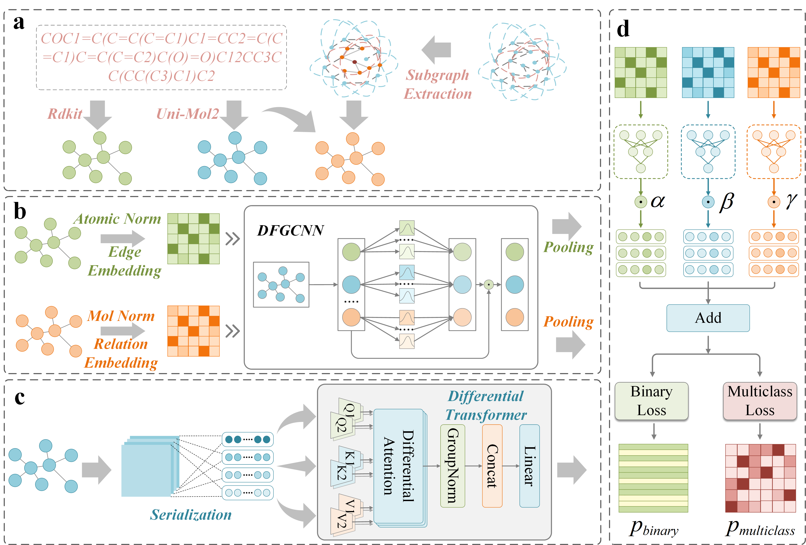

# A Unified Differential Denoising Learning Framework with a Pre-trained Model and Fuzzy Graph Networks for Drug-Drug Interaction Prediction (UDPF-DDI)


### Abstract

Combination therapy has become increasingly prevalent in modern clinical practice, yet the concomitant issue of drug-drug interactions (DDIs) poses significant challenges to medication safety. Accurate DDI prediction is therefore crucial for both drug development and clinical regulation. However, existing methods exhibit limitations in handling the inherent uncertainty of molecular data and attention noise in interaction modeling. This study proposes **UDPF-DDI**, a unified differential denoising learning framework with a pre-trained model and fuzzy graph networks for drug-drug interaction prediction. First, multi-source feature representations were constructed for drug molecules: high-dimensional feature representations were extracted using the large-scale molecular pre-trained model Uni-Mol2, while low-dimensional graph structures were obtained via RDKit. Second, a parallel three-channel encoder was employed. This utilized a fuzzy graph convolution neural network (FGCNN) to capture high-order fuzzy features reflecting internal chemical environments and external network topologies of molecules. Simultaneously, the high-dimensional 3D atomic features generated by the molecular pre-trained model were refined and denoised using a differential Transformer. Subsequently, graph readout and adaptive fusion operations weighted and integrated the outputs from the three channels to derive the final interaction scores for drug pairs. Finally, corresponding loss functions were applied to compute the interaction probability matrix. Results from five-fold cross-validation on multiple real-world binary and multi-class datasets demonstrated that UDPF-DDI achieved significant performance improvements across various evaluation metrics compared to several state-of-the-art baseline models. It exhibited exceptional capability, particularly in handling data uncertainty and denoising drug features.

---

### UDPF-DDI Framework



---
### Getting Started

#### Prerequisites

To run the code, you'll need the following Python environment setup:

- **Python**: 3.8
- **PyTorch**: 1.12.0+cu113
- **Numpy**: 1.23.0
- **rdkit**: 2024.3.2
- **torch_geometric**: 2.6.1
- **torch_scatter**: 2.1.0+pt112cu113
- **pandas**: 1.3.5

---

### Running the Code

The repository is structured by task. Navigate to the specific task folder to run the model.

1.  **Navigate to the task directory**:
    ```bash
    cd <task_name>
    ```
    (e.g., `cd binary` or `cd multi_rel`)

2.  **Run the training script**:
    ```bash
    python train.py
    ```

For additional arguments and configuration options, please refer to the `train.py` script and the configuration files within each task folder.
